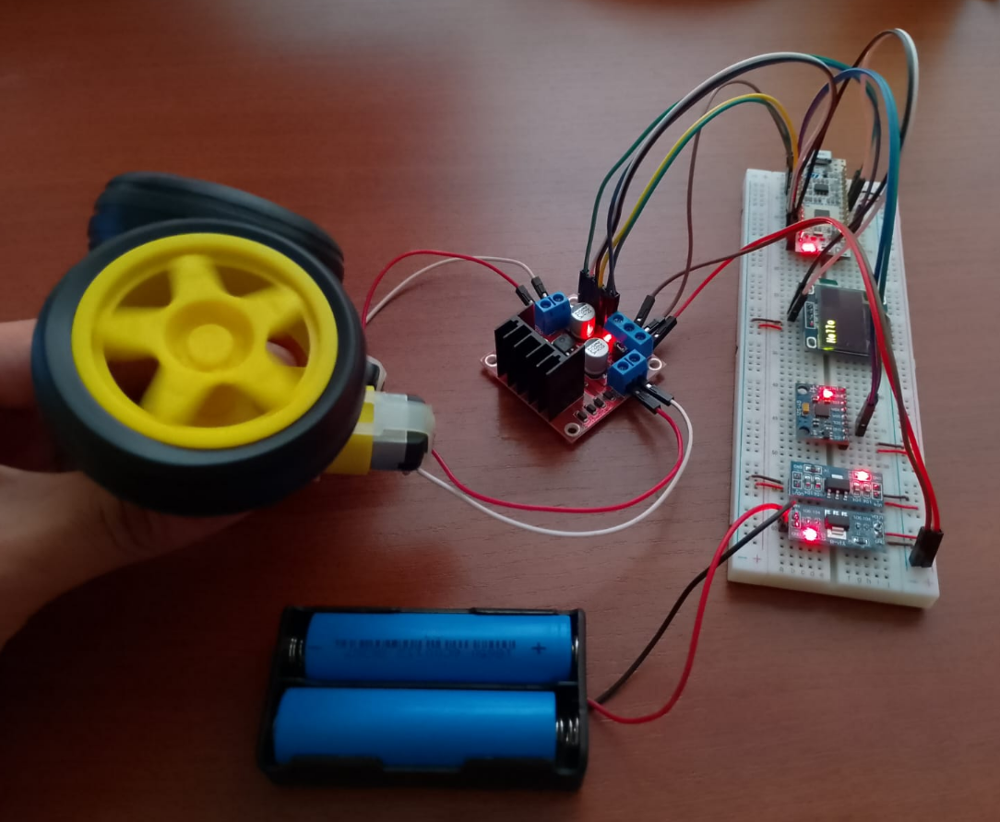

# Self-Balancing Robot Project

  

  <em>Self-Balancing Robot Breadboard Prototype for Testing and Programming.</em>

## Overview

This repository presents the design, implementation, and experimental validation of a self-balancing robot developed as a personal engineering project.
The system is based on an STM32 NUCLEO-L432KC microcontroller and uses an MPU6050 inertial measurement unit (IMU) for real-time orientation estimation. The project emphasizes embedded control, sensor fusion fundamentals, and motor actuation to stabilize the robot around its vertical equilibrium position.

## Methods

A PID control algorithm was implemented directly on the STM32 microcontroller. The controller processes real-time orientation data acquired from the MPU6050 and compares it against a predefined vertical reference angle.
Based on the resulting error, the control law dynamically adjusts the direction and speed of the motors, enabling the robot to maintain balance and compensate for external disturbances.

## System Description

The self-balancing robot integrates the following components, selected according to their respective datasheets:

- **MPU6050 IMU**: 6-axis inertial sensor providing 3-axis acceleration and angular velocity data for attitude estimation  
- **OLED Display (SH1106)**: displays system status and real-time debugging information  
- **DC Gear Motor**: provides mechanical actuation required for balance control  
- **L298N Motor Driver**: dual H-bridge driver for bidirectional motor control  
- **3.3 V and 5 V Voltage Regulator Modules**: power management for logic and peripherals  
- **3.7 V LiPo Batteries**: portable power supply for autonomous operation  

## Repository Structure

- `datasheets/`: reviewed datasheets for all electronic components
- `documentation/`: technical documentation according to project progress
- `hardware/`: PCB schematic, PCB layout, and 3D mechanical design of the robot
- `images/`: reference images showing hardware and development progress
- `user_manuals/`: user manuals related to the STM32 microcontroller

## Hardware Setup
The following hardware and tools were used during development and testing:
- STM32 NUCLEO-L432KC
- DC gear motor
- NEMA 17 stepper motor
- MPU6050 IMU
- OLED Display (SH1106)
- A4988 motor driver
- Laboratory power supply (12 V, 3 A)
- Digital multimeter
- 3.3 V and 5 V voltage regulator modules
- 3.7 V LiPo batteries

## Requirements
- **IDEs**:
  - STM32CubeIDE
- **Programming Languages**:
  - C
- **Libraries**:
  - MPU6050 sensor library
  - SH1106 library

## Author
**David Fernando Evangelista Cuti** 
National University of Engineering (UNI), Peru

